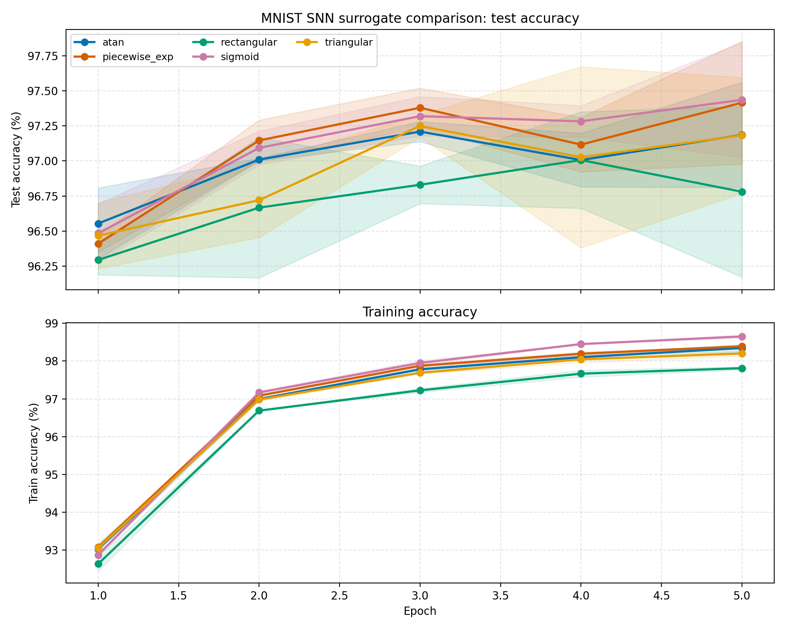

# MNIST SNN Surrogate Gradient Comparison

- Time: 2026-06-24 22:42:56
- Surrogates: atan, piecewise_exp, rectangular, sigmoid, triangular
- Seeds: 2024, 2025, 2026
- Epochs: 5
- Batch size: 128
- Learning rate: 0.001
- T: 6
- Hidden size: 512
- Gamma: 1.0
- Alpha: None
- Train samples: full
- Test samples: full
- Target accuracy for convergence: 97.00%

## Accuracy Curves

## Summary

| surrogate | runs | final_test_acc | best_epoch | best_test_acc | test_acc_auc | epoch_to_target | seconds/run |
| --- | --- | --- | --- | --- | --- | --- | --- |
| sigmoid | 3 | 97.44+/-0.41% | 5 | 97.44+/-0.41% | 97.12 | 2 | 57.14+/-0.22s |
| piecewise_exp | 3 | 97.42+/-0.44% | 5 | 97.42+/-0.44% | 97.09 | 2 | 57.42+/-0.36s |
| atan | 3 | 97.19+/-0.38% | 3 | 97.21+/-0.07% | 96.99 | 2 | 57.12+/-0.16s |
| triangular | 3 | 97.18+/-0.41% | 3 | 97.25+/-0.08% | 96.93 | 3 | 57.82+/-0.39s |
| rectangular | 3 | 96.78+/-0.61% | 4 | 97.01+/-0.34% | 96.72 | 4 | 58.06+/-0.61s |

## Conclusion

- Highest final mean test accuracy: **sigmoid** (97.44+/-0.41%).
- Fastest overall convergence by mean test-accuracy AUC: **sigmoid** (AUC=97.12).
- A higher AUC means the curve stayed higher across training, which captures both speed and final quality.

## Files

- Plot: `mnist/surrogate_training_curves.png`
- Raw per-run CSV: `mnist/surrogate_runs_raw.csv`
- Aggregated curve CSV: `mnist/surrogate_curves.csv`
- Summary CSV: `mnist/surrogate_summary.csv`

## Per-Epoch Mean Curves

### atan

| epoch | train_acc | test_acc | train_loss | test_loss |
| --- | --- | --- | --- | --- |
| 1 | 93.03+/-0.13% | 96.55+/-0.25% | 0.2367+/-0.0013 | 0.1129+/-0.0059 |
| 2 | 96.99+/-0.04% | 97.01+/-0.01% | 0.0971+/-0.0004 | 0.0953+/-0.0034 |
| 3 | 97.78+/-0.05% | 97.21+/-0.07% | 0.0715+/-0.0009 | 0.0879+/-0.0033 |
| 4 | 98.10+/-0.06% | 97.01+/-0.19% | 0.0588+/-0.0013 | 0.0968+/-0.0086 |
| 5 | 98.34+/-0.10% | 97.19+/-0.38% | 0.0512+/-0.0024 | 0.0925+/-0.0086 |

### piecewise_exp

| epoch | train_acc | test_acc | train_loss | test_loss |
| --- | --- | --- | --- | --- |
| 1 | 93.07+/-0.08% | 96.41+/-0.06% | 0.2347+/-0.0013 | 0.1166+/-0.0036 |
| 2 | 97.08+/-0.02% | 97.15+/-0.15% | 0.0934+/-0.0010 | 0.0928+/-0.0086 |
| 3 | 97.88+/-0.04% | 97.38+/-0.14% | 0.0673+/-0.0010 | 0.0826+/-0.0043 |
| 4 | 98.19+/-0.05% | 97.12+/-0.20% | 0.0548+/-0.0009 | 0.0923+/-0.0096 |
| 5 | 98.39+/-0.02% | 97.42+/-0.44% | 0.0487+/-0.0006 | 0.0851+/-0.0106 |

### rectangular

| epoch | train_acc | test_acc | train_loss | test_loss |
| --- | --- | --- | --- | --- |
| 1 | 92.63+/-0.20% | 96.29+/-0.11% | 0.2600+/-0.0025 | 0.1247+/-0.0030 |
| 2 | 96.69+/-0.01% | 96.67+/-0.50% | 0.1086+/-0.0012 | 0.1100+/-0.0169 |
| 3 | 97.22+/-0.05% | 96.83+/-0.13% | 0.0882+/-0.0012 | 0.0993+/-0.0024 |
| 4 | 97.67+/-0.09% | 97.01+/-0.34% | 0.0748+/-0.0018 | 0.0967+/-0.0081 |
| 5 | 97.81+/-0.04% | 96.78+/-0.61% | 0.0690+/-0.0012 | 0.1033+/-0.0213 |

### sigmoid

| epoch | train_acc | test_acc | train_loss | test_loss |
| --- | --- | --- | --- | --- |
| 1 | 92.87+/-0.05% | 96.48+/-0.21% | 0.2405+/-0.0009 | 0.1134+/-0.0059 |
| 2 | 97.17+/-0.04% | 97.09+/-0.12% | 0.0916+/-0.0008 | 0.0927+/-0.0041 |
| 3 | 97.95+/-0.07% | 97.32+/-0.14% | 0.0645+/-0.0010 | 0.0869+/-0.0049 |
| 4 | 98.45+/-0.01% | 97.28+/-0.11% | 0.0478+/-0.0008 | 0.0900+/-0.0061 |
| 5 | 98.65+/-0.05% | 97.44+/-0.41% | 0.0415+/-0.0019 | 0.0852+/-0.0117 |

### triangular

| epoch | train_acc | test_acc | train_loss | test_loss |
| --- | --- | --- | --- | --- |
| 1 | 93.05+/-0.04% | 96.47+/-0.24% | 0.2391+/-0.0013 | 0.1149+/-0.0051 |
| 2 | 96.98+/-0.04% | 96.72+/-0.27% | 0.0975+/-0.0012 | 0.1016+/-0.0084 |
| 3 | 97.69+/-0.03% | 97.25+/-0.08% | 0.0746+/-0.0007 | 0.0871+/-0.0016 |
| 4 | 98.04+/-0.09% | 97.03+/-0.65% | 0.0618+/-0.0021 | 0.0979+/-0.0238 |
| 5 | 98.20+/-0.07% | 97.18+/-0.41% | 0.0554+/-0.0014 | 0.0923+/-0.0138 |
